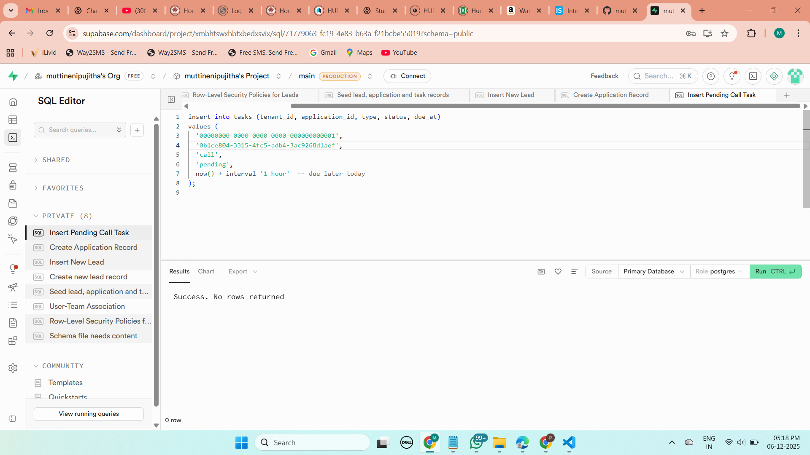
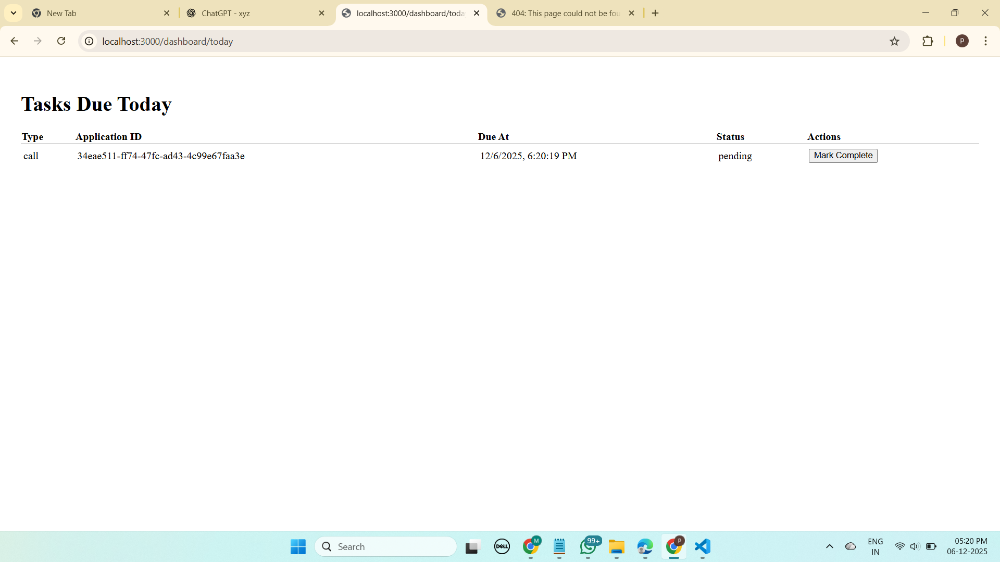
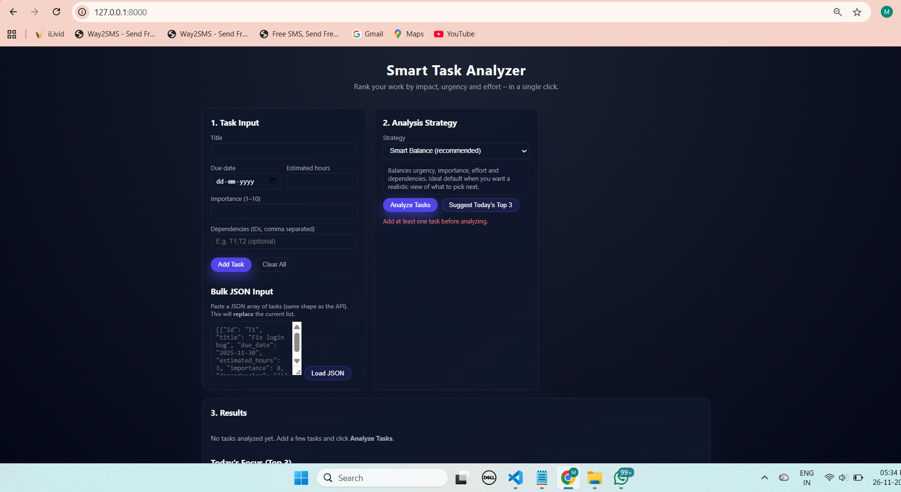

# LearnLynk – Technical Assessment (Completed Submission)

This repository contains my completed solution for the LearnLynk technical assessment.  
The goal of this project is to demonstrate database schema design, Supabase RLS, Edge Functions, and a simple Next.js dashboard for task management.

---

# 📌 Deliverables Overview

| Task | File |
|------|------|
| Task 1 — Database Schema | `backend/schema.sql` |
| Task 2 — RLS Policies | `backend/rls_policies.sql` |
| Task 3 — Edge Function `/create-task` | `backend/edge-functions/create-task/index.ts` |
| Task 4 — Next.js Page `/dashboard/today` | `frontend/pages/dashboard/today.tsx` |
| Task 5 — Stripe Checkout Answer | Included at bottom of this README |

---

# 🧱 Task 1 — Database Schema

File: **`backend/schema.sql`**

Tables implemented:

- `leads`
- `applications`
- `tasks`

All tables include:

```sql
id uuid primary key default gen_random_uuid(),
tenant_id uuid not null,
created_at timestamptz default now(),
updated_at timestamptz default now()
Additional requirements implemented:
applications.lead_id → FK → leads.id

tasks.application_id → FK → applications.id

tasks.type uses a CHECK constraint allowing only 'call', 'email', 'review'

tasks.due_at >= created_at

Indexes added for efficient queries:

Leads: (tenant_id, owner_id, stage)

Applications: (tenant_id, lead_id)

Tasks: (tenant_id, due_at, status)

🔐 Task 2 — Row-Level Security
File: backend/rls_policies.sql

RLS is enabled and policies fully implemented.

Access Control Rules
Counselors can read:

Leads they own (owner_id = user_id)

Leads belonging to teams they are part of (user_teams)

Admins can read all leads within their tenant

INSERT operations allowed for counselors/admins inside their own tenant

JWT Assumptions:

java
Copy code
user_id
tenant_id
role ("admin" or "counselor")
⚡ Task 3 — Supabase Edge Function: /create-task
File: backend/edge-functions/create-task/index.ts

Function Responsibilities
Accept JSON input:

json
Copy code
{
  "application_id": "uuid",
  "task_type": "call",
  "due_at": "2025-01-01T12:00:00Z"
}
Validation:
task_type must be call, email, or review

due_at must be:

a valid timestamp

in the future

Output:
json
Copy code
{ "success": true, "task_id": "..." }
Errors:
400 → Validation error

500 → Internal server/db error

A Supabase Realtime event task.created is also emitted.

💻 Task 4 — Next.js Page /dashboard/today
File: frontend/pages/dashboard/today.tsx

Features:
Fetches tasks due today where status ≠ completed

Displays a clean table:

task type

application ID

due date

status

Includes a “Mark Complete” button using:

ts
Copy code
supabase.from("tasks").update()
Auto-refresh after mutation

Includes loading and error states

💳 Task 5 — Stripe Answer
Stripe Answer
When a user initiates payment, I insert a payment_requests row with amount, currency, application_id, and status = 'pending'.

The backend creates a Stripe Checkout Session using stripe.checkout.sessions.create(), including metadata with the payment_request_id.

I store the returned session.id (and optionally payment_intent) in the DB so webhook events can be tied back to the request.

The frontend receives the session.url and redirects the user to Stripe Checkout.

A secure webhook endpoint validates Stripe signatures using the webhook secret.

On checkout.session.completed or payment_intent.succeeded, the payment_requests row is updated to status = 'succeeded'.

The related applications row is updated to a new stage such as "fee_paid".

Failed or expired sessions update payment_requests.status to "failed" or "expired".

## 🖼️ Screenshots

These screenshots demonstrate database tests, UI functionality, and task actions.

### 1️⃣ SQL – Task Insert Test in Supabase


### 2️⃣ UI – Task Appearing in Dashboard with "Mark Complete"


### 3️⃣ UI – After Completing the Task (“No tasks due today 🎉”)



🛠 Local Setup & Run Instructions
1. Frontend
arduino
Copy code
cd frontend
npm install
npm run dev
Visit:

bash
Copy code
http://localhost:3000/dashboard/today
2. Environment Variables
Add frontend/.env.local:

ini
Copy code
NEXT_PUBLIC_SUPABASE_URL=your-url
NEXT_PUBLIC_SUPABASE_ANON_KEY=your-anon-key
3. Supabase Database
Run the schema and RLS scripts:

pgsql
Copy code
backend/schema.sql
backend/rls_policies.sql
4. Edge Function
Serve locally:

pgsql
Copy code
supabase functions serve create-task
Deploy:

pgsql
Copy code
supabase functions deploy create-task
✔ Notes / Assumptions
Supporting tables like users, teams, and user_teams were assumed to exist.

Service role key is used only inside Edge Function (never client-side).

.env.local stays uncommitted for security.

🎉 Thank You!
This completes the LearnLynk technical assessment.
Please review the attached implementation and screenshots.